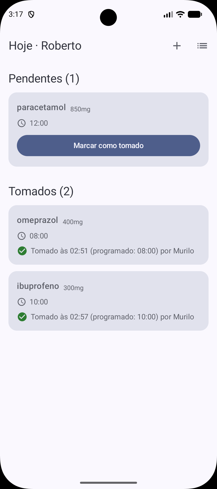
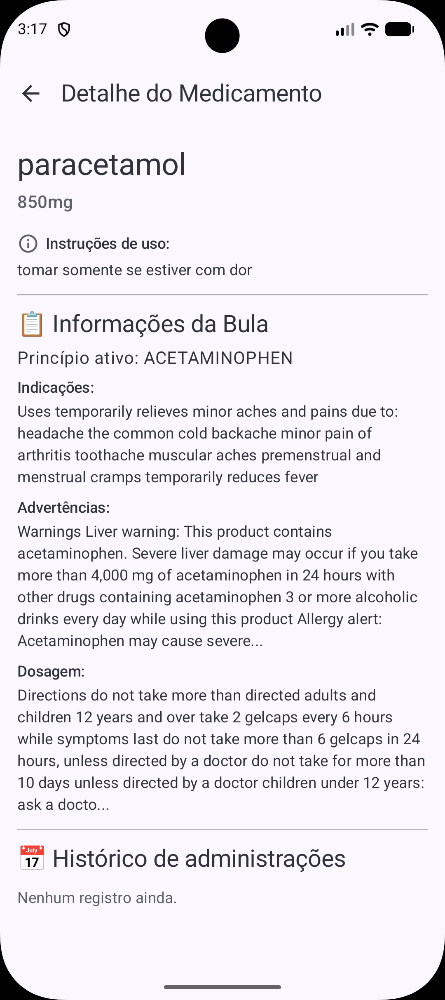
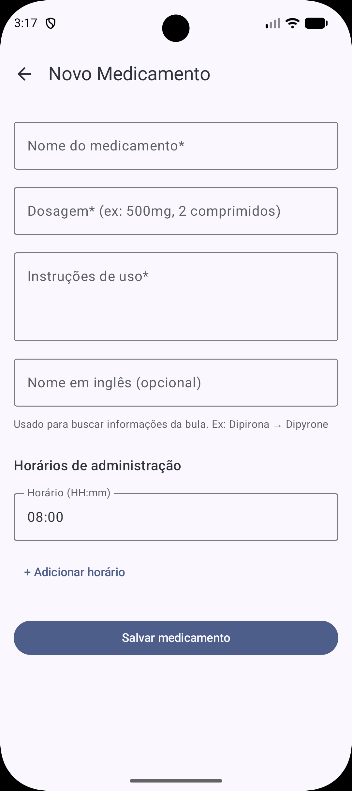
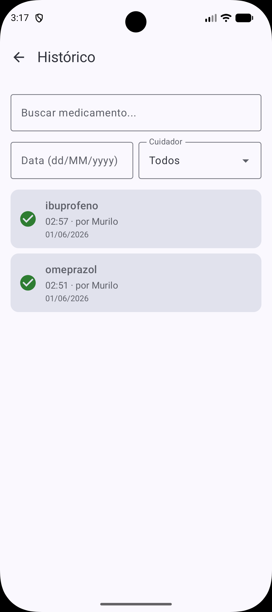

# MedLembrete
 
Aplicativo Android para controle colaborativo de medicamentos, desenvolvido como projeto da disciplina de Programação de Dispositivos Móveis (PDM) no IFPB — Campus João Pessoa.
 
---
 
## Problema
 
Famílias que cuidam de idosos ou pacientes em tratamento contínuo lidam com uma dúvida frequente: **"Alguém já deu o remédio das 8h?"** A falta de comunicação entre cuidadores gera dois riscos reais — a dose esquecida ou a dose duplicada. O MedLembrete resolve isso com um painel compartilhado e sincronizado em tempo real.
 
---
 
## Telas
 
| Home | Detalhe | Cadastro | Histórico |
|------|---------|----------|-----------|
|  |  |  |  |
 
---
 
## Funcionalidades
 
- Feed diário com medicamentos separados em **Pendentes** e **Tomados**
- Confirmação de dose com registro do horário e do cuidador responsável
- Sincronização em tempo real entre dispositivos via Firestore
- Detalhamento do medicamento com informações de bula (via API da FDA)
- Cadastro de medicamentos com suporte a múltiplos horários
- Histórico de administrações com busca e filtros por nome, data e cuidador
---
 
## Tecnologias
 
- **Linguagem:** Kotlin
- **UI:** Jetpack Compose + Material Design 3
- **Banco de dados:** Firebase Cloud Firestore
- **API REST:** OpenFDA Drug Label API (via Retrofit)
- **Navegação:** Navigation Compose
- **Arquitetura:** MVVM com repositórios e StateFlow
---
 
## Como rodar
 
**Pré-requisitos:** Android Studio Hedgehog ou superior, JDK 17+
 
```bash
git clone https://github.com/franciscovmn/MedLembrete.git
```
 
Abra o projeto no Android Studio, aguarde o sync do Gradle e clique em **Run**.
 
> O arquivo `google-services.json` já está incluído no repositório e aponta para o banco de dados de desenvolvimento do projeto.
 
---
 
## Estrutura do projeto
 
```
app/src/main/java/br/edu/ifpb/pdm/medlembrete/
├── model/          # Entidades do domínio
├── repository/     # Interfaces e implementações (Firestore + Mock)
├── service/        # Regras de negócio
├── network/        # Retrofit + OpenFDA
├── enums/          # StatusMedicacao
└── ui/
    ├── navigation/ # Rotas
    ├── screens/    # Composables de tela
    ├── viewmodel/  # ViewModels e estados de UI
    ├── components/ # Composables reutilizáveis
    └── util/       # Extensions e utilitários
```
 
---
 
## Equipe
 
| GitHub | Responsabilidades |
|--------|-------------------|
| [@muciri](https://github.com/muciri) | Modelagem das entidades, Configuração do Firestore, criação dos services |
| [@Felipejjjj](https://github.com/Felipejjjj) | Camada de rede, Retrofit, integração OpenFDA |
| [@franciscovmn](https://github.com/franciscovmn) | UI, navegação, Firestore em tempo real, arquitetura |
 
---
 
## Instituição
 
**IFPB — Instituto Federal da Paraíba**  
Campus João Pessoa · Disciplina: Programação de Dispositivos Móveis  
Professor: Edemberg Rocha · 2026.1
